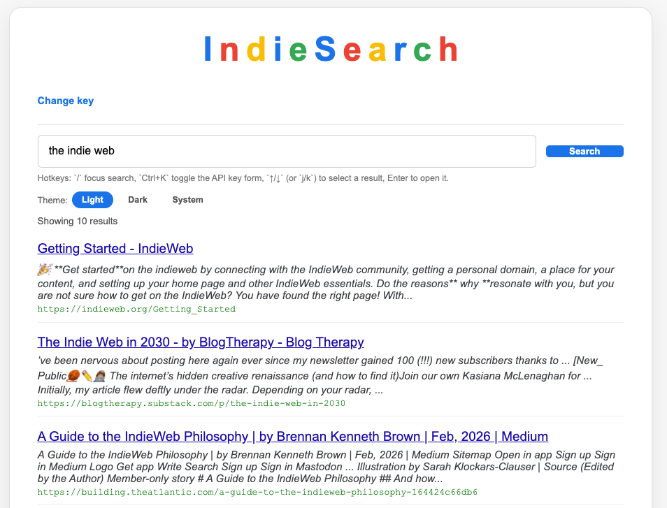

# Indie Search

Indie Search is a static, BYO key front end for Exa that nods to early-2000s search styling while adding modern conveniences like country-aware requests, keyboard navigation, and theme controls. It stores your key and preferences in the browser, calls Exa via `fetch`, and renders up to 10 results as blue titles/green URLs with descriptions. The provider dropdown can switch between Exa.ai (full search results) and Serper Search (browser-friendly GET that requires its own API key). A live demo is hosted at https://indie-search.statichost.page/ (note: the demo can’t access your Exa/Serper keys, so searches only work when you run the app locally with your own keys).

## Requirements

- **Exa.ai API key**: The app talks directly to Exa, so you must grab an API key from https://dashboard.exa.ai/api-keys and paste it into the form before searching.
- **Serper Search API key** (OPTIONAL): Serper’s REST API at https://serper.dev/ requires an API key (sent as the `apiKey` query parameter).
- **Static hosting/local server**: Browsers block local files from running the script, which is why you need to serve `index.html` via a static host or local server (see the Running locally section below).

## Running locally

You need to serve the files from a local web server so the browser can load `index.html` and execute the JavaScript. Here are two easy commands from the repo root:

- **Python 3**: `python3 -m http.server 8000` (or `python -m http.server 8000` on systems where `python` is mapped to Python 3). Open `http://localhost:8000/?s=your+query`.
- **PHP built-in server** (if PHP is installed): `php -S localhost:8000`. Navigate to the same URL once the server prints the listening message.

Because the app is entirely static, your Exa API key and country choice never leave your computer—they are held in `localStorage`.

## Features

- **BYO key panel**: Enter and save your Exa API key once; the form collapses and keeps a “Change key” toggle for updates.
- **Country selector**: Choose your country and Exa receives it as `userLocation` plus the `numResults` parameter so results align with your locale.
- **Provider switcher**: Swap between Exa.ai (full searches) and Serper Search (keyed GET requests to Serper’s public endpoint). The UI saves the key for whichever provider you select so you can flip back and forth without retyping it.
- **Retro interface**: A serif “Indie Search” wordmark, centered shell, pastel result cards, blue titles, and green URLs echo the nostalgia of early search engines.
- **Keyboard hotkeys**: `/` focuses search, `Ctrl+K` toggles the key panel, `↑/↓` or `j/k` highlight results, and Enter opens the highlighted link.
- **Theme switcher**: Pick light, dark, or “system” (follows `prefers-color-scheme`) with pill buttons; the selection is saved for future visits.
- **Query permalink**: The `?s=` parameter in the URL mirrors your query so you can bookmark or share searches, and loading such a URL auto-runs the query once a key is stored.

## Make Indie Search your default

1. Run the local server (see above) and keep the page open.
2. In your browser’s search engine settings add a custom engine pointing to `http://localhost:8000/?s=%s` (use `%s` or `{searchTerms}` depending on the browser).
3. Set that custom engine as the default or assign it a shortcut (for example, type `i` + space to fire Indie Search).

Every search still happens locally, so your API key stays inside the browser.
